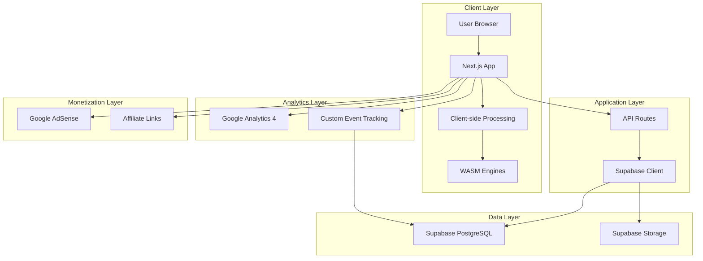

# 🏗️ System Architecture

**Document:** System Architecture & Design Patterns  
**Version:** 2.0.0  
**Last Updated:** December 11, 2025  
**Status:** ✅ Production Ready

[← Back to Architecture Index](./README.md)

---

## 🏗️ System Architecture Overview



---

## 🔧 Processing Architecture (Client-Side First)

### Processing Flow

```typescript
// Processing Flow
Client Browser
    ↓
1. File Upload (No server upload)
    ↓
2. Client-side Validation
    ↓
3. WASM/JS Processing Engine
    ├── Image: ffmpeg.wasm / imagemagick.wasm
    ├── PDF: pdf-lib / pdf.js
    ├── Video: ffmpeg.wasm
    └── Text/Data: Pure JS
    ↓
4. Fake Progress Bar (3-5s for UX)
    ↓
5. Result Download (Blob URL)
    ↓
6. Track Event → Supabase + GA4
```

### Processing Engines

| Tool Type | Processing Library | Bundle Size | Load Strategy |
|-----------|-------------------|-------------|---------------|
| **Image** | `@ffmpeg/ffmpeg` | ~31MB | Lazy load on first use |
| **Image** | `browser-image-compression` | ~50KB | Pre-load (small) |
| **PDF** | `pdf-lib` | ~400KB | Lazy load |
| **PDF** | `react-pdf` | ~200KB | Lazy load |
| **Video** | `@ffmpeg/ffmpeg` | Same as image | Lazy load |
| **QR Code** | `qrcode.react` | ~20KB | Pre-load |
| **Text** | Native JS | 0KB | Always available |

### Client-Side Validation

```typescript
// lib/processors/file-validator.ts
export interface ValidationResult {
  valid: boolean;
  error?: string;
  fileInfo?: {
    name: string;
    size: number;
    type: string;
    extension: string;
  };
}

export async function validateFile(
  file: File,
  options: {
    maxSize?: number; // bytes
    allowedTypes?: string[];
    allowedExtensions?: string[];
  }
): Promise<ValidationResult> {
  // 1. Check file exists
  if (!file) {
    return { valid: false, error: 'No file provided' };
  }

  // 2. Check file size
  if (options.maxSize && file.size > options.maxSize) {
    return {
      valid: false,
      error: `File too large. Max: ${options.maxSize / 1024 / 1024}MB`,
    };
  }

  // 3. Validate magic bytes (not just extension)
  const arrayBuffer = await file.slice(0, 12).arrayBuffer();
  const bytes = new Uint8Array(arrayBuffer);
  const actualType = detectFileType(bytes);

  if (options.allowedTypes && !options.allowedTypes.includes(actualType)) {
    return {
      valid: false,
      error: `Invalid file type. Allowed: ${options.allowedTypes.join(', ')}`,
    };
  }

  return {
    valid: true,
    fileInfo: {
      name: file.name,
      size: file.size,
      type: actualType,
      extension: file.name.split('.').pop() || '',
    },
  };
}
```

---

## 🎨 Architecture Patterns

### 1. **Server Components + Client Components**

```typescript
// app/[locale]/tools/[slug]/page.tsx (Server Component)
export default async function ToolPage({ params }) {
  const { tool } = await getToolConfig(params.slug);
  
  return (
    <>
      {/* Static SEO content - Server Component */}
      <ToolHeader tool={tool} />
      
      {/* Interactive tool - Client Component */}
      <ToolInterface toolId={tool.id} />
      
      {/* Static content - Server Component */}
      <ToolDescription tool={tool} />
    </>
  );
}

// components/tools/ToolInterface.tsx (Client Component)
'use client';

export function ToolInterface({ toolId }: { toolId: string }) {
  const [file, setFile] = useState<File | null>(null);
  const [processing, setProcessing] = useState(false);
  
  // Client-side interactivity
  return <div>...</div>;
}
```

### 2. **Lazy Loading Heavy Libraries**

```typescript
// lib/processors/lazy-loader.ts
export async function loadFFmpeg() {
  if (typeof window === 'undefined') return null;
  
  const { FFmpeg } = await import('@ffmpeg/ffmpeg');
  const { toBlobURL } = await import('@ffmpeg/util');
  
  const ffmpeg = new FFmpeg();
  
  await ffmpeg.load({
    coreURL: await toBlobURL(
      `https://unpkg.com/@ffmpeg/core@0.12.6/dist/umd/ffmpeg-core.js`,
      'text/javascript'
    ),
    wasmURL: await toBlobURL(
      `https://unpkg.com/@ffmpeg/core@0.12.6/dist/umd/ffmpeg-core.wasm`,
      'application/wasm'
    ),
  });
  
  return ffmpeg;
}

// Usage in component
const ffmpeg = await loadFFmpeg();
```

### 3. **Error Boundary Pattern**

```typescript
// components/error-boundary/ErrorBoundary.tsx
'use client';

import { Component, ReactNode } from 'react';

interface Props {
  children: ReactNode;
  fallback?: ReactNode;
}

interface State {
  hasError: boolean;
  error?: Error;
}

export class ErrorBoundary extends Component<Props, State> {
  constructor(props: Props) {
    super(props);
    this.state = { hasError: false };
  }

  static getDerivedStateFromError(error: Error): State {
    return { hasError: true, error };
  }

  componentDidCatch(error: Error, errorInfo: any) {
    // Log to Supabase
    logError({
      message: error.message,
      stack: error.stack,
      componentStack: errorInfo.componentStack,
    });
  }

  render() {
    if (this.state.hasError) {
      return this.props.fallback || <DefaultErrorUI />;
    }

    return this.props.children;
  }
}
```

### 4. **Progressive Enhancement**

```typescript
// Check WASM support
if ('WebAssembly' in window) {
  // Use WASM-based processing
  await loadFFmpeg();
} else {
  // Fallback to basic JS processing
  await loadBasicImageProcessor();
}
```

---

## 📡 API Architecture

### API Route Structure

```
/api/
├── track/
│   └── route.ts          # POST: Track analytics events
├── feedback/
│   └── route.ts          # POST: Submit user feedback
├── tools/
│   ├── route.ts          # GET: List all tools
│   └── [id]/
│       └── route.ts      # GET: Get tool details
├── proposals/
│   └── route.ts          # POST: Submit tool proposal
└── health/
    └── route.ts          # GET: Health check
```

### API Response Format

```typescript
// Standard API response
export interface ApiResponse<T = any> {
  success: boolean;
  data?: T;
  error?: {
    code: string;
    message: string;
    details?: any;
  };
  meta?: {
    timestamp: string;
    requestId: string;
  };
}

// Example usage
export async function POST(request: Request) {
  try {
    const data = await processRequest(request);
    
    return Response.json({
      success: true,
      data,
      meta: {
        timestamp: new Date().toISOString(),
        requestId: crypto.randomUUID(),
      },
    });
  } catch (error) {
    return Response.json({
      success: false,
      error: {
        code: 'PROCESSING_ERROR',
        message: error.message,
      },
    }, { status: 500 });
  }
}
```

---

## 🔄 Data Flow Architecture

### Analytics Event Flow

```
User Action
    ↓
useAnalytics hook
    ↓
trackEvent() function
    ├──→ Google Analytics 4 (gtag)
    └──→ Supabase (via API route)
            ↓
        analytics_events table
            ↓
        Aggregated reports
```

### Tool Processing Flow

```
User uploads file
    ↓
validateFile()
    ↓
Show fake progress bar (UX)
    ↓
processTool()
    ├── Load WASM engine (if needed)
    ├── Process file (client-side)
    └── Generate output (Blob)
    ↓
Download trigger
    ↓
trackEvent('tool_completed')
    ↓
Cleanup memory
```

---

## 🛡️ Security Architecture

### Defense Layers

1. **Client-Side Validation**
   - File type checking (magic bytes)
   - File size limits
   - Extension validation

2. **Rate Limiting**
   - Redis-based (Vercel KV)
   - Per IP address
   - Per endpoint

3. **Content Security Policy**
   - Restrict script sources
   - Prevent XSS
   - Control frame embedding

4. **Input Sanitization**
   - DOMPurify for user HTML
   - SQL parameterization
   - API input validation (Zod)

See [Security Checklist](./23-security-checklist.md) for complete details.

---

## 🚀 Performance Architecture

### Optimization Strategies

1. **Code Splitting**
   - Route-based (automatic with Next.js)
   - Component-based (React.lazy)
   - Library-based (dynamic imports)

2. **Caching Layers**
   - Static assets (CDN, max-age: 1 year)
   - API responses (stale-while-revalidate)
   - Supabase queries (React Query)

3. **Image Optimization**
   - Next.js Image component
   - Automatic WebP/AVIF
   - Responsive sizes
   - Lazy loading

4. **Bundle Optimization**
   - Tree shaking (automatic)
   - Minification (production)
   - Compression (gzip/brotli)
   - Bundle analyzer monitoring

See [Performance Budget](./25-performance-budget.md) for targets.

---

## 🌍 Multi-Region Architecture

### Deployment Strategy

```
User Request
    ↓
Vercel Edge Network (Global CDN)
    ├──→ Edge Function (nearest region)
    │       ↓
    │   Next.js Server Components
    │       ↓
    │   API Routes
    │       ↓
    └──→ Supabase (single region)
            ↓
        PostgreSQL + Storage
```

### Regions

- **Edge:** 275+ global locations (Vercel)
- **Compute:** Auto-scaled serverless (Vercel)
- **Database:** us-east-1 (Supabase)
- **CDN:** CloudFlare (via Vercel)

---

## 📊 Monitoring Architecture

### Observability Stack

```
Application
    ├──→ Vercel Analytics (Performance)
    ├──→ Sentry (Errors)
    ├──→ Google Analytics 4 (User behavior)
    ├──→ Supabase (Custom events)
    └──→ Uptime Robot (Availability)
```

### Key Metrics

- **Performance:** TTFB, FCP, LCP, FID, CLS, TBT, SI, TTI
- **Errors:** Error rate, error types, affected users
- **Business:** MAU, tool usage, revenue
- **Infrastructure:** Uptime, response time, function duration

---

## 🔗 Related Documents

- **Project Structure:** [Project Structure](./02-project-structure.md)
- **Routing:** [Routing & SEO](./03-routing-seo.md)
- **Technology:** [Tech Stack](./10-technology-stack.md)
- **Database:** [Database Schema](./11-database-schema.md)
- **APIs:** [API Documentation](./12-api-documentation.md)

---

[← Back to Architecture Index](./README.md)

**Document Version:** 2.0.0  
**Last Updated:** December 11, 2025  
**Next Review:** Post-Launch (Q1 2026)
