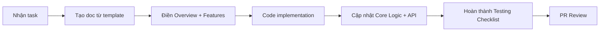

# 📚 Feature Documentation Guide

> Hướng dẫn tạo và quản lý documentation cho từng tool trong hệ thống Multi-Purpose Tool.

---

## 📁 Cấu Trúc Thư Mục

```
docs/feature/
├── _TEMPLATE.md              # Template mẫu (copy để tạo doc mới)
├── README.md                 # File này - hướng dẫn sử dụng
│
├── password/                 # Group: Password & Security Tools
│   ├── generator.md          # ✅ Password Generator (SAMPLE)
│   ├── strength-checker.md   # Password Strength Checker
│   ├── hash-encode.md        # Hash / Encode Toolkit
│   └── ...
│
├── text/                     # Group: Text Tools
│   ├── diff.md
│   ├── case-converter.md
│   └── ...
│
├── json/                     # Group: JSON / YAML / XML Tools
│   ├── format-validate.md
│   └── ...
│
└── [group-id]/               # Other groups...
    └── [tool-id].md
```

---

## 🚀 Cách Tạo Doc Cho Tool Mới

### Bước 1: Copy Template

```bash
# Windows PowerShell
Copy-Item "docs/feature/_TEMPLATE.md" "docs/feature/[group]/[tool-id].md"

# Ví dụ:
Copy-Item "docs/feature/_TEMPLATE.md" "docs/feature/text/case-converter.md"
```

### Bước 2: Điền Thông Tin Bắt Buộc

Các section **BẮT BUỘC** phải hoàn thành:

| Section | Priority | Khi nào điền |
|---------|----------|--------------|
| Overview | 🔴 Critical | Trước khi code |
| Features | 🔴 Critical | Trước khi code |
| File Structure | 🔴 Critical | Trước khi code |
| Dependencies | 🟡 Important | Trước khi code |
| Component API | 🟡 Important | Trong khi code |
| Core Logic | 🟡 Important | Trong khi code |
| i18n Keys | 🟢 Nice-to-have | Sau khi code |
| Testing Checklist | 🟢 Nice-to-have | Sau khi code |

### Bước 3: Review Checklist

Trước khi merge, đảm bảo:

- [ ] Tool ID khớp với `tools.registry.ts`
- [ ] Status được cập nhật đúng
- [ ] Dependencies list đầy đủ
- [ ] Core logic được document
- [ ] i18n keys được định nghĩa

---

## 📋 Mapping: Code ↔ Docs

| Code Location | Docs Location |
|---------------|---------------|
| `src/features/tools/password/generator/` | `docs/feature/password/generator.md` |
| `src/features/tools/text/diff/` | `docs/feature/text/diff.md` |
| `src/features/tools/json/format-validate/` | `docs/feature/json/format-validate.md` |

**Quy tắc:**
- Tên folder trong code = Tên file `.md` trong docs
- Group ID từ `tools.registry.ts` = Tên folder trong docs

---

## 👥 Phân Công Team

### Team Assignment

| Member | Tool Groups | Docs Responsibility |
|--------|-------------|---------------------|
| **Member A** | `password`, `data`, `dev` | Tự viết docs cho tools của mình |
| **Member B** | `text`, `json`, `image` | Tự viết docs cho tools của mình |
| **Member C** | `pdf`, `random`, `datetime` | Tự viết docs cho tools của mình |

### Workflow



---

## ✅ Doc Quality Checklist

### Minimum Viable Doc (MVD)

Để được merge, doc phải có:

```markdown
✅ Tool ID, Group, Status chính xác
✅ Overview với User Stories
✅ Features list với status
✅ File Structure
✅ Dependencies (external + internal)
✅ Component API (Props, State)
```

### Complete Doc

Để tool được mark là "production-ready":

```markdown
✅ Tất cả MVD requirements
✅ Core Logic với pseudocode/algorithm
✅ UI/UX Specifications
✅ Accessibility requirements
✅ i18n keys hoàn chỉnh
✅ Testing Checklist pass
✅ Changelog updated
```

---

## 📖 Sample Reference

Xem file mẫu hoàn chỉnh:
- **[Password Generator](./password/generator.md)** - Full documentation example

---

## 🔗 Related Resources

- [Project Coding Standards](../../.bmad/docs/project-coding-standards.md)
- [Tool Implementation Guide](../../src/features/tools/IMPLEMENTATION_GUIDE.md)
- [Tools Registry](../../src/config/tools.registry.ts)

---

## ❓ FAQ

### Q: Khi nào cần cập nhật doc?

A: Cập nhật khi:
- Thêm feature mới
- Thay đổi API/Props
- Fix bug quan trọng
- Thay đổi dependencies

### Q: Doc có cần viết bằng tiếng Anh không?

A: 
- **Headers, code, API**: Tiếng Anh
- **Description, notes**: Có thể tiếng Việt

### Q: File quá dài, có thể chia nhỏ không?

A: Có, với tools phức tạp:
```
docs/feature/pdf/
├── converter.md           # Main doc
├── converter-api.md       # Chi tiết API
└── converter-algorithms.md # Chi tiết algorithms
```

---

*Last updated: December 2024*
